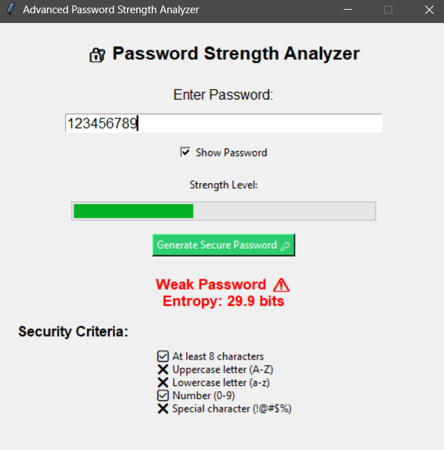
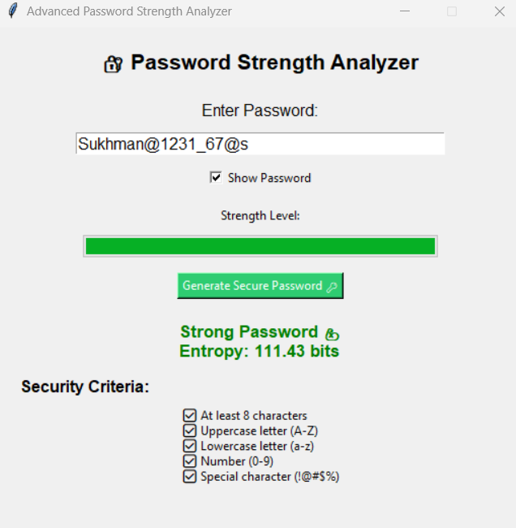

Password Strength Analyzer

An advanced Password Strength Analyzer built using Python and Tkinter.  
This application evaluates password strength using entropy-based scoring and security rules.

📌 Project Overview

This project checks how strong a password is by analyzing:

- Length of the password
- Uppercase and lowercase letters
- Numbers
- Special characters
- Entropy-based strength calculation

It also helps users generate secure passwords.

🚀 Features

✔ Real-time password strength checking  
✔ Entropy-based scoring system  
✔ Secure password generation  
✔ User-friendly GUI using Tkinter  

🛠️ Technologies Used

- Python
- Tkinter (GUI)
- Regular Expressions

▶️ How to Run the Project
 
1. Clone the repository:git clone https://github.com/your-username/Password-Strength-Analyzer.git.
2. 2.Open the project folder.
3. Run:python passwordproject.py

📸 Screenshot

🎯 Future Improvements

- Add password breach detection
- Improve UI design
- Add dark mode
- Export password report feature

👩‍💻 Author

Sukhmanpreet Kaur  
BTech CSE Student | Cybersecurity Enthusiast
